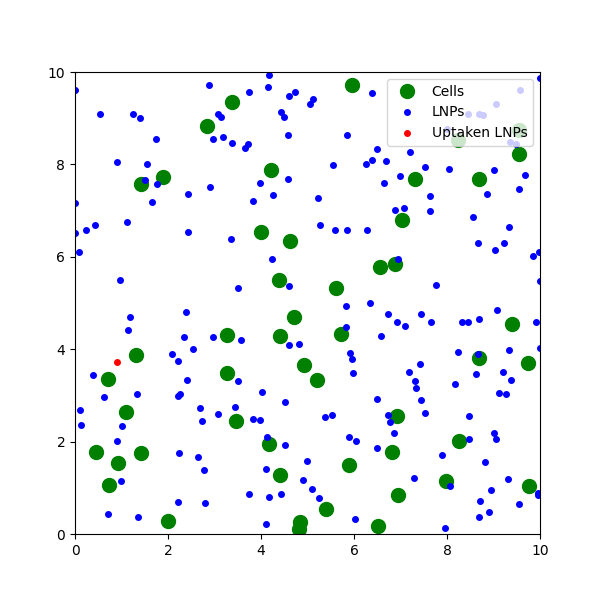

# Lipid Nanoparticle Uptake Simulation 🧬

This is a Python simulation that models how lipid nanoparticles (LNPs) interact with and are taken up by cells. It reflects real-world scenarios in drug delivery, including CRISPR gene editing and mRNA vaccines.

##  How It Works

- Cells and LNPs are randomly placed in a 2D space.
- Uptake depends on distance and probability.
- Visual output shows free vs uptaken LNPs vs cells.

##  Real-World Application

- **mRNA Vaccines** (like COVID)
- **CRISPR Delivery**
- **Cancer Therapy**
- **Nanomedicine Research**

##  Technologies Used

- Python
- NumPy
- Matplotlib

##  Output Example

 Created By

Nirajan Raj Kunwar student researcher & science outreach advocate from Nepal 🇳🇵  
Founder of [100 Brilliant Minds Nepal](https://nextgeniusnepal.org)

##  License

MIT License

